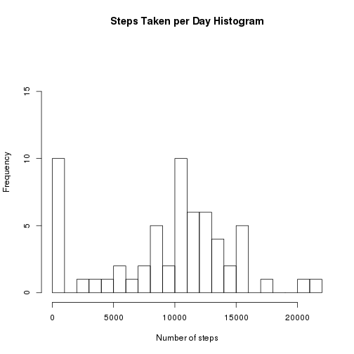
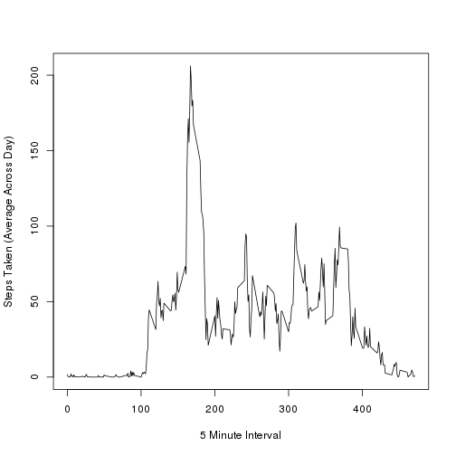
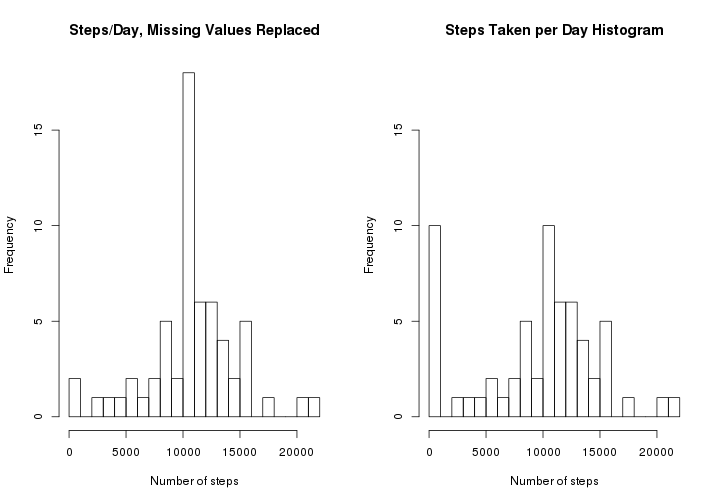
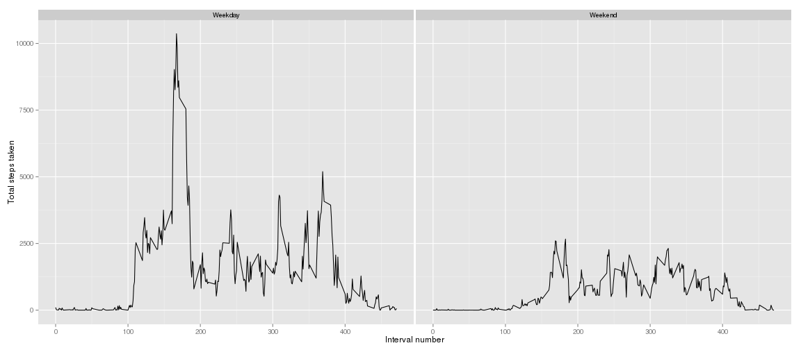

Reproducable Data Analysis: Peer Assessment 1
=============================================

Compute various bits of summary data on data collected by a digital pedometer by a single
individual between October and November, in 2012.

* Mean, median steps taken per day
* Surprise bonus:  Which 5 minute interval has the highest average number of steps
* Number of steps taken in each 5 minute interval, averaged across days
* Reporting on the total number of missing observations
* Comparative plots of weekend vs weekday activity by 5 minute interval

## Notes

The `interval` field counts from 0 to 2355 in steps of 5.  If this is taken to be the number of minutes offset in to the day, then 39.25 hours worth of data are recorded every day.
`hist(data$interval)` indicates that the distribution of observations is nearly even, so observations at offset 2355 are nearly as common as those at offset 0, so it's unlikely
that the recording device was simply restarted irregularly but at the same time when restarted.
This value containing a number of minute offset into the day seems unlikely.

<!---

    Note that syntax highlighting is turned off in run.sh

    steps: Number of steps taking in a 5-minute interval (missing values are coded as NA)
    date: The date on which the measurement was taken in YYYY-MM-DD format
    interval: Identifier for the 5-minute interval in which measurement was taken

  Commit PA1_template.Rmd, PA1_template.md, PA1_template.html and the figure/ directory.
  "If your document has figures included (it should) then they should have been placed in the figure/ directory by default"
-->

## Load Data

Extract the `zip` file if needed (the `zip` file came with the git repository).


```text
if(!file.exists("activity.csv")) {
    unzip("activity.zip")
}

read.csv("activity.csv") -> data
```

## What is mean total number of steps taken per day?

Ignoring missing values, plot a histogram of number of steps taken per day,
and report on the mean and median number of steps taken per day.

Aggregate data to find the number of steps taken for each recorded day:


```text
split_by_day <- split(data, data$date)
total_steps = sapply(split_by_day, function(x) sum(x$steps, na.rm = T) )
```

<!---
    I'm not sure what this 2400 number is.
    print((60*24)/2400) = 0.6
    60*24 minutes in a day, but 2400 minutes (counted up to in units of 5) is 0.6 of that.
    It seems like data isn't collected throughout the entire day.
-->

Plot a histogram of frequency of occurrence of different numbers of steps taken for each recorded day:


```text
# we're going to re-run this one again later so keep it as a function

steps_taken_plot = function() {
    hist(
        total_steps,
        breaks=30,               # turn this up for more detail
        xlab = "Number of steps",
        ylab="Frequency",
        main="Steps Taken per Day Histogram",
        ylim = c(0, 18),
    )
}

steps_taken_plot()
```

 

Total steps and median steps taken each day:


```text
mean(total_steps)
```

```
## [1] 9354.23
```

```text
median(total_steps)
```

```
## [1] 10395
```

## Five minute interval with the highest average number of steps

Five minute interval that on average contains the highest number of steps taken each day.
This was a surprise; I saw it in the grading form but not in the project description.


```text
# split data by interval
split_by_interval <- split(data, data$interval)

# take the mean of all samples (each different day) for that interval
# after this, names() contains the name of the interval
interval_by_mean_steps = sapply(split_by_interval, function(x) mean(x$steps, na.rm = T) )

# which interval has the largest mean number of steps?
busiest_interval = names(interval_by_mean_steps)[which.max(interval_by_mean_steps)]
busiest_interval       # actual name of the interval
```

```
## [1] "835"
```

```text
as.numeric(busiest_interval) / 5   # to be consistent with axis on charges
```

```
## [1] 167
```

This corresponds to the sharp peak on the following chart.


## What is the average daily activity pattern?

Combine (average) 5 minute interval data for all available days and plot a line graph of these average numbers of steps taken.
Failing to convert the interval into a timestamp, we number them sequentially.


```text
average_steps_by_interval <- sapply(split(data, data$interval), function(x) mean(x$steps, na.rm=T) )

# so it turns out that the interval number is most likely not a number of minutes offset in to the day
# so we can't put nice time of the day labels on this plot
# average_steps_by_interval_timestamp <- 
#    as.POSIXct(60 * as.numeric(names(average_steps_by_interval)), tz="GMT", origin="1970-01-01" )
# plot( type="l", average_steps_by_interval_timestamp, average_steps_by_interval )

plot( 
    type="l", 
    # so just make them smaller, sequential numbers
    as.numeric(names(average_steps_by_interval)) / 5, 
    average_steps_by_interval, 
    xlab="5 Minute Interval", 
    ylab="Steps Taken (Average Across Day)" 
)
```

 

## Imputing missing values

Calculate and report the total number of missing values in the dataset:


```text
missing = nrow(data[is.na(data$steps), ])
missing
```

```
## [1] 2304
```

```text
missing / nrow(data)  # relative number of missing values
```

```
## [1] 0.1311475
```

Requirements:
"Devise a strategy for filling in all of the missing values in the dataset.
Create a new dataset that is equal to the original dataset but with the missing data filled in."

Fill in missing values using daily averages for that interval.
This pulls data from `average_steps_by_interval` to supply missing data into `data_imputed`.
`data_imputed` starts as a copy of `data`.


```text
# use average_steps_by_interval from above to supply missing data

# data_imputed starts as a copy of data
data_imputed = data

# find NA values and pull values from the same interval in average_steps_by_interval
for( i in 1:nrow(data) ) {
    data_imputed$steps[i] <- if(is.na(data$steps[i]) ) 
        # index average_steps_by_interval by name
        # names() for average_steps_by_interval are the intervals; eg 0, 5, 10, 15, etc
        # as.character() returns a character string which forces this behavior rather than using
        # a number which would address a cardinal location
        average_steps_by_interval[as.character(data$interval[i])] 
    else 
        data$steps[i]
}
```

<!---
    # sanity check
    # at this point, all non-NA values in data$steps are equal to the corresponding value in data_imputed$steps
    sum(data$steps == data_imputed$steps, na.rm = 1)
    [1] 15264
    sum(data$steps != data_imputed$steps, na.rm = 1)
    [1] 0
-->

"Make a histogram of the total number of steps taken each day"

This time using the gap-filled data, plot a histogram of frequency of occurrence of different numbers of steps taken for each recorded day:


```text
split_by_day_imputed <- split(data_imputed, data_imputed$date)
total_steps_imputed = sapply(split_by_day_imputed, function(x) sum(x$steps, na.rm = T) )

par(mfcol = c(1, 2))   # set up a row of two plots to easily compare this and the previous plot

hist(
    total_steps_imputed,
    breaks=30,               # turn this up for more detail
    xlab = "Number of steps",
    ylab="Frequency",
    ylim = c(0, 18),
    main="Steps/Day, Missing Values Replaced"
)

steps_taken_plot()     # display the original, un-gap-filled plot, again
```

 

"Calculate and report the mean and median total number of steps taken per day."

Original, uncorrected data is repeated here for comparison, followed by corrected data with missing values estimated:


```text
data.frame( 
    uncorrected_mean_daily_steps = mean(total_steps), 
    uncorrected_median_daily_steps = median(total_steps) 
)
```

```
##   uncorrected_mean_daily_steps uncorrected_median_daily_steps
## 1                      9354.23                          10395
```

```text
data.frame( 
    corrected_mean_daily_steps = mean(total_steps_imputed), 
    corrected_median_daily_steps = median(total_steps_imputed) 
)
```

```
##   corrected_mean_daily_steps corrected_median_daily_steps
## 1                   10766.19                     10766.19
```

"Do these values differ from the estimates from the first part of the assignment? What is the impact of imputing missing data on the estimates of the total daily number of steps?"

Yes, these values differ.

Looking at the gap filled data, it seems data was often not collected during periods of moderate levels of walking, 
causing the number of 10,000 range step days to be under reported.

Lack of data also caused the number of days with 0-1000 steps to be grossly over reported.

Correcting this shifts the data to forming an approximate bell curve with a very narrow central band.

## Are there differences in activity patterns between weekdays and weekends?

Using the gap-filled data, we compare weekend activity to weekday activity.

This is as above for "What is the average daily activity pattern?", but with data for week days and week ends separated and compared.


```text
library(ggplot2)

# "Create a new factor variable in the dataset with two levels -- "weekday" and "weekend"
# indicating whether a given date is a weekday or weekend day."

data_imputed$day <- weekdays(as.Date(data_imputed$date))
data_imputed$weekday <- "Weekday"     # all days are weekdays...
data_imputed$weekday[                 # unless they're Sat/Sun
    data_imputed$day == "Saturday" | data_imputed$day == "Sunday" 
] <- "Weekend"
data_imputed$weekday = as.factor(data_imputed$weekday)

# split the data by both weekday(end) and interval

split_by_interval_weekend_imputed <- split(data_imputed, list( data_imputed$weekday, data_imputed$interval ) )

# for each group of data, the weekend(day) and the interval is constant, so take that and then
# sum the steps taken

steps_by_weekend_imputed = data.frame(
    weekend = sapply(split_by_interval_weekend_imputed, function(x) x$weekday[1]),
    interval = sapply(split_by_interval_weekend_imputed, function(x) x$interval[1]),
    total_steps = sapply(split_by_interval_weekend_imputed, function(x) sum(x$steps) )
)

# total steps by interval, panel plot across weekend(day)

qplot(
    interval / 5, 
    total_steps, 
    geom = c('line'), 
    data = steps_by_weekend_imputed, 
    facets = . ~ weekend, 
    xlab = "Interval number",
    ylab = "Total steps taken",
) 
```

 

Yes, weekends look different.

The start of activity is delayed, not as intense (especially in the morning), but, to some degree, continues on later in to the evening.

## Author

Scott Walters

`scott@slowass.net`
